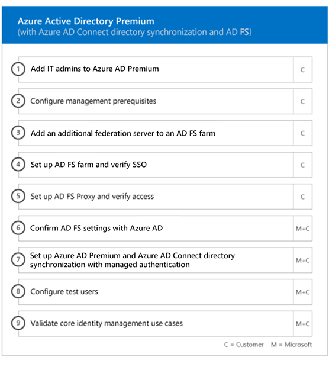

# ขั้นตอนการออนบอร์ด

> [!CAUTION]
> เนื้อหานี้ไม่ได้อยู่ในปัจจุบันอีกต่อไปและมีการจัดกำหนดการสำหรับการเอาออก ใช้สารบัญในการนำทางด้านซ้ายสำหรับเนื้อหาปัจจุบัน

เมื่อคุณใช้บริการที่มี [สิทธิ์และแผน](M365-eligible-services-and-plans.md) เพื่อรับ Microsoft Azure Active directory Premium, microsoft Intune และการป้องกันข้อมูล Azure พร้อมใช้งานอยู่มีหลายขั้นตอนที่เกี่ยวข้องกับกระบวนการ ส่วนต่อไปนี้อธิบายขั้นตอนแต่ละขั้นตอนของกระบวนการปฐมนิเทศ

ปฐมนิเทศมีขั้นตอนหลักสี่ขั้นตอนดังนี้

## ขั้นตอนการเริ่มต้น

หลังจากที่คุณซื้อจำนวนสิทธิ์การใช้งานที่เหมาะสมแล้วให้ทำตามคำแนะนำจากอีเมลยืนยันการสั่งซื้อเพื่อเชื่อมโยงสิทธิ์การใช้งานกับผู้เช่าหรือผู้เช่าใหม่ที่มีอยู่แล้วของคุณ Microsoft แล้วตรวจสอบสิทธิ์ของคุณสำหรับสิทธิประโยชน์ของศูนย์ FastTrack และพยายามติดต่อคุณเพื่อขอรับความช่วยเหลือปฐมนิเทศ

> [!NOTE]
> นอกจากนี้คุณยังสามารถขอรับความช่วยเหลือจาก [ไซต์ FastTrack](https://go.microsoft.com/fwlink/?linkid=780698) ได้ถ้าคุณพร้อมที่จะปรับใช้บริการเหล่านี้สำหรับองค์กรของคุณ

### เมื่อต้องการร้องขอความช่วยเหลือ

1. ลงชื่อเข้าใช้[ไซต์ FastTrack](https://go.microsoft.com/fwlink/?linkid=780698)
2. เลือก **ร้องขอความช่วยเหลือสำหรับ microsoft ๓๖๕** จากการ **ดำเนินการด่วน** ที่ด้านบนของหน้า landing page ของคุณหรือโดยการเลือก **คำขอความช่วยเหลือสำหรับ Microsoft ๓๖๕** บนการ์ดปรับใช้
3. ทำการ **ร้องขอความช่วยเหลือสำหรับฟอร์ม Microsoft ๓๖๕**ให้เสร็จสมบูรณ์

เมื่อการสนับสนุนปฐมนิเทศเริ่มต้นแล้วเราจะตั้งค่ากำหนดการการประชุมแบบออนไลน์

คู่ค้าของ Microsoft ยังสามารถรับความช่วยเหลือผ่าน [ไซต์ FastTrack](https://go.microsoft.com/fwlink/?linkid=780698) ในนามของลูกค้าได้ เมื่อต้องการทำเช่นนี้ให้ทำดังนี้

1. ลงชื่อเข้าใช้[ไซต์ FastTrack](https://go.microsoft.com/fwlink/?linkid=780698)
2. เลือก**ลูกค้าของฉัน**
3. ค้นหาลูกค้าของคุณหรือเลือกจากรายชื่อลูกค้าของคุณ
4. เลือก**บริการ**
5. ทำการ **ร้องขอความช่วยเหลือสำหรับฟอร์ม Microsoft ๓๖๕**ให้เสร็จสมบูรณ์

เมื่อการสนับสนุนปฐมนิเทศเริ่มต้นแล้ว FastTrack จะตั้งค่ากำหนดการการประชุมแบบออนไลน์กับคุณเพื่อหารือเกี่ยวกับกระบวนการปฐมนิเทศตรวจสอบความถูกต้องของข้อมูลและตั้งค่าการประชุมเริ่มต้น

## การประเมินขั้นตอน

เมื่อกระบวนการปฐมนิเทศเริ่มต้นแล้วศูนย์การ FastTrack จะทำงานร่วมกับคุณในการประเมินสภาพแวดล้อมต้นฉบับของคุณและความต้องการ เครื่องมือจะทำงานเพื่อประเมินสภาพแวดล้อมของคุณและผู้เชี่ยวชาญ FastTrack จะแนะนำคุณผ่านการประเมินไดเรกทอรีที่ใช้งานอยู่ภายในองค์กรของคุณเบราว์เซอร์อินเทอร์เน็ต, ระบบปฏิบัติการของไคลเอ็นต์, ระบบ Domain Name (DNS), เครือข่าย, โครงสร้างพื้นฐานและระบบข้อมูลประจำตัวเพื่อตรวจสอบว่ามีการเปลี่ยนแปลงใดที่จำเป็นสำหรับปฐมนิเทศ

ศูนย์การ FastTrack ยังเชื่อมต่อคุณกับคำแนะนำเกี่ยวกับวิธีการขับรถที่ประสบความสำเร็จของบริการที่มีสิทธิ์

โดยยึดตามการตั้งค่าปัจจุบันของคุณเราจะมีแผนการทำงานที่จะนำสภาพแวดล้อมต้นฉบับของคุณไปใช้กับความต้องการขั้นต่ำสำหรับการปฐมนิเทศที่ประสบความสำเร็จไปยัง EMS หรือบริการ cloud แต่ละรายการ นอกจากนี้เรายังตั้งค่าจุดตรวจสอบที่เหมาะสมสำหรับขั้นตอนด้าน

## เฟส Remediate
คุณทำงานในแผนการใช้งานในสภาพแวดล้อมต้นฉบับของคุณเพื่อให้คุณมีคุณสมบัติตรงตามข้อกำหนดสำหรับปฐมนิเทศและนำบริการแต่ละรายการ (ตามต้องการ)

ก่อนที่คุณจะเริ่มขั้นตอนการเปิดใช้งานเราจะตรวจสอบผลลัพธ์ของกิจกรรมด้านต่างๆเพื่อให้แน่ใจว่าคุณพร้อมที่จะดำเนินการต่อไป

## เปิดใช้งานขั้นตอน
เมื่อกิจกรรมที่มีความสำคัญทั้งหมดเสร็จสิ้นโครงการจะเลื่อนไปยังการกำหนดค่าโครงสร้างพื้นฐานสำหรับปริมาณการใช้บริการและการเตรียมใช้งานบริการ EMS ของ EMS ที่มีสิทธิ์แต่ละรายการ

**เปิดใช้งานความสามารถหลักของขั้นตอน**

หลักปฐมนิเทศที่เกี่ยวข้องกับการจัดเตรียมบริการและการรวมผู้เช่าและข้อมูลประจำตัว นอกจากนี้ยังมีขั้นตอนสำหรับการจัดเตรียมรากฐานสำหรับบริการออนไลน์ปฐมนิเทศเช่น Azure AD Premium, Intune และการป้องกันข้อมูล Azure

> [!NOTE]
> WAP ยืนสำหรับพร็อกซีแอปพลิเคชันบนเว็บ SSL ยืนสำหรับ Secure Sockets Layer SDS ที่ยืนสำหรับการซิงค์ข้อมูลของโรงเรียน สำหรับข้อมูลเพิ่มเติมเกี่ยวกับ SDS ให้ดู[ที่ยินดีต้อนรับสู่การซิงค์ข้อมูลของโรงเรียนของ Microsoft](https://go.microsoft.com/fwlink/?linkid=871480)

> [!NOTE]
> วิธีการรับรองความถูกต้องที่มีการจัดการมีอยู่แต่ไม่จำกัดเฉพาะการซิงโครไนซ์แฮชของรหัสผ่าน การรวมข้อมูลประจำตัวเป็นกิจกรรมหนึ่งครั้งและไม่รวมถึงการโยกย้ายหรือการรื้อถอนของวิธีการรับรองความถูกต้องที่มีอยู่เช่นการจัดการหรือที่ติดต่อกับภายนอก

### เปิดใช้งานเฟส-Azure AD Premium

สภาพแวดล้อมของ Azure AD Premium สามารถตั้งค่าได้โดยใช้การซิงโครไนซ์ไดเรกทอรีของไดเรกทอรีที่ใช้งานอยู่ของ Azure และบริการสหพันธรัฐไดเรกทอรีที่ใช้งานอยู่ (AD FS) (ถ้าจำเป็น)

สำหรับสถานการณ์ Azure AD Premium ที่รวมข้อมูลประจำตัวภายในองค์กรที่ซิงโครไนซ์กับระบบคลาวด์เราจะช่วยคุณได้โดยการเพิ่มผู้ดูแลระบบ IT และผู้ใช้ลงในการสมัครใช้งานของคุณการกำหนดค่าข้อกำหนดเบื้องต้นการจัดการการตั้งค่าของ Azure AD Premium การตั้งค่าการซิงโครไนซ์ไดเรกทอรีที่มีการรับรองความถูกต้องและ AD FS ใช้เครื่องมือ

การตั้งค่า Azure AD Premium รวมถึงการเปิดใช้งานฟีเจอร์ต่อไปนี้:

-   Azure Active Directory ตั้งค่ารหัสผ่านแบบบริการตนเอง (SSPR)

-   การรับรองความถูกต้องแบบหลายปัจจัย azure (Azure MFA)

-   สูงสุดสาม (3) หรือซอฟต์แวร์เพิ่มเติมเป็นแอปพลิเคชันบริการ (SaaS) ที่รวมกับการลงชื่อเข้าระบบครั้งเดียว (SSO) จากการใช้[งานไดเรกทอรีที่ใช้งานอยู่ของ Azure Marketplace](https://azure.microsoft.com/marketplace/active-directory/)

-   การเตรียมการของผู้ใช้โดยอัตโนมัติสำหรับแอปพลิเคชัน SaaS ที่รวมไว้ล่วงหน้าตามที่แสดงอยู่ใน [รายการบทช่วยสอนการรวมแอป](https://docs.microsoft.com/azure/active-directory/saas-apps/tutorial-list)จำกัดเฉพาะการจัดเตรียมขาออกเท่านั้น

-   หน้าจอการเข้าสู่ระบบแบบกำหนดเองรวมถึงโลโก้ข้อความและรูปภาพ

-   กลุ่มแบบบริการตนเองและแบบไดนามิก (กลุ่ม)

-   พร็อกซีแอปพลิเคชันไดเรกทอรีของ Azure ที่ใช้งานอยู่

-   Azure Active Directory เชื่อมต่อสถานภาพ

-   การเข้าถึงตามเงื่อนไขของไดเรกทอรีที่ใช้งานอยู่ของ Azure

-   ข้อกำหนดการใช้ของไดเรกทอรีที่ใช้งานอยู่ของ Azure

-   การป้องกันข้อมูลประจำตัวของไดเรกทอรีที่ใช้งานอยู่ของ Azure

-   การจัดการข้อมูลประจำตัวของ Azure Active Directory ที่มีสิทธิ์การใช้งาน

-   การเข้าถึงไดเรกทอรีที่ใช้งานอยู่ของ Azure

-   การป้องกันด้วยรหัสผ่านของ Azure Active Directory

-   ไดเรกทอรีที่ใช้งานอยู่ของ Azure B2B

### เปิดใช้งานขั้นตอน-Intune

สำหรับ Intune เราจะแนะนำคุณเกี่ยวกับการเตรียมพร้อมสำหรับการใช้ Microsoft Intune เพื่อจัดการอุปกรณ์ ขั้นตอนที่แน่นอนจะขึ้นอยู่กับสภาพแวดล้อมต้นฉบับของคุณและขึ้นอยู่กับอุปกรณ์เคลื่อนที่ของคุณและความต้องการในการจัดการแอปสำหรับอุปกรณ์เคลื่อนที่ ขั้นตอนเหล่านี้อาจรวมถึง:

-   สิทธิ์การใช้งานผู้ใช้ของคุณ นอกจากนี้เรายังมีความช่วยเหลือเกี่ยวกับวิธีการเปิดใช้งานสิทธิ์การใช้งานระดับเสียงสำหรับผู้เช่า Microsoft cloud service ของคุณ (ตามที่จำเป็น)

-   การกำหนดค่าผู้ใช้อีเมลสำหรับใช้โดย Intune โดยใช้ประโยชน์จากไดเรกทอรีที่ใช้งานอยู่ภายในองค์กรของคุณหรือผู้ใช้อีเมล cloud

-   การเพิ่มผู้ใช้ลงในการสมัครใช้งาน Intune ของคุณการกำหนดบทบาทผู้ดูแลระบบไอทีและการสร้างกลุ่มผู้ใช้และอุปกรณ์

-   การกำหนดค่าหน่วยงานการจัดการอุปกรณ์เคลื่อนที่ (MDM) ของคุณโดยยึดตามความต้องการของฝ่ายจัดการของคุณซึ่งรวมถึง:

    -   การตั้งค่า Intune เป็นหน่วยงานของ MDM เมื่อ Intune เป็นโซลูชัน MDM ของคุณเท่านั้น

-   การให้คำแนะนำ MDM สำหรับ:

    -   การกำหนดค่ากลุ่มการทดสอบที่จะใช้ในการตรวจสอบนโยบายการจัดการ MDM

    -   การกำหนดค่านโยบายการจัดการ MDM และบริการต่างๆเช่น:

        -   การปรับใช้แอปพลิเคชันสำหรับแต่ละแพลตฟอร์มที่ได้รับการสนับสนุนผ่านลิงก์เว็บหรือลิงก์ลึก

        -   นโยบายการเข้าถึงแบบมีเงื่อนไข

        -   การปรับใช้อีเมลเครือข่ายไร้สายและโปรไฟล์เครือข่ายส่วนตัวเสมือน (VPN) ถ้าคุณมีผู้มีสิทธิ์ออกใบรับรองที่มีอยู่, Wi-fi หรือโครงสร้างพื้นฐาน VPN ในองค์กรของคุณ

        -   การตั้งค่าตัวเชื่อมต่อ Exchange Intune ของ Microsoft (เมื่อสามารถใช้งานได้)

        -   การเชื่อมต่อกับคลังข้อมูล Intune

        -   รวม Intune ด้วย:
            -   ตัวแสดงทีมสำหรับความช่วยเหลือระยะไกล (จำเป็นต้องใช้การสมัครใช้งานของทีม)

            -   โซลูชั่นการป้องกันภัยคุกคามทางโทรศัพท์มือถือ (MTD) (จำเป็นต้องมีการสมัครใช้งานการป้องกันภัยคุกคามบนมือถือ)

            -   โซลูชันการจัดการค่าใช้จ่ายของเทเลคอม (จำเป็นต้องมีการสมัครใช้งานโซลูชันการจัดการค่าใช้จ่ายในการโทรคมนาคม)

            -   การป้องกันการคุกคามขั้นสูงของ microsoft Defender (Windows E5 หรือ Microsoft ๓๖๕ E5 สิทธิ์การใช้งานจำเป็น)

    -   การลงทะเบียนอุปกรณ์ของแต่ละ [แพลตฟอร์มที่ได้รับการสนับสนุน](https://technet.microsoft.com/library/dn600287.aspx) ไปยัง Intune

-   การให้คำแนะนำในการป้องกันแอป:

    -   การกำหนดค่านโยบายการป้องกันแอปสำหรับแต่ละแพลตฟอร์มที่ได้รับการสนับสนุน

    -   การกำหนดค่านโยบายการเข้าถึงแบบมีเงื่อนไขสำหรับแอปที่ได้รับการจัดการ

    -   การกำหนดเป้าหมายกลุ่มผู้ใช้ที่เหมาะสมกับนโยบายด้านบนของแหม่ม

    -   การใช้รายงานการใช้งานแอปพลิเคชันที่มีการจัดการ

-   การให้คำแนะนำในการจัดการพีซี:

    -   การติดตั้งซอฟต์แวร์ไคลเอ็นต์ Intune (ถ้าจำเป็น)

    -   การใช้รายงานซอฟต์แวร์และฮาร์ดแวร์ที่พร้อมใช้งานใน Intune

    > [!IMPORTANT]
    > FastTrack ไม่สนับสนุนการจัดการพีซีแบบคลาสสิกของ Windows 10 ด้วย Intune FastTrack สนับสนุนการจัดการอุปกรณ์ Windows 10 ผ่าน Intune ของอุปกรณ์เคลื่อนที่ของ Intune (MDM) เท่านั้น

#### Windows Autopilot

FastTrack จะช่วยให้คุณสามารถทำการเตรียมใช้งานอุปกรณ์ของคุณด้วย Windows Autopilot และ Intune โดยการให้อุปกรณ์ใหม่แก่ผู้ใช้ของคุณโดยไม่จำเป็นต้องสร้างการบำรุงรักษาและนำรูประบบปฏิบัติการแบบกำหนดเองไปใช้กับอุปกรณ์ของคุณ

FastTrack สนับสนุนสถานการณ์สมมติ Autopilot ต่อไปนี้:

- **AZURE AD service ด้วยตนเอง:** อุปกรณ์เข้าร่วม Azure AD และลงทะเบียนใน Intune สถานการณ์นี้ได้รับการสนับสนุนเมื่อใช้ Windows ๑๐๑๗๐๓และเวอร์ชันล่าสุด

- **บริการตนเองของไฮบริด AAD:** อุปกรณ์จะเข้าร่วมทั้งโฆษณาในสถานที่และ Azure AD และลงทะเบียนใน Intune สถานการณ์นี้ได้รับการสนับสนุนเมื่อใช้ Windows ๑๐๑๘๐๙และเวอร์ชันล่าสุด

- การเตรียมใช้งาน**ด้วยตนเอง:** อุปกรณ์จะเข้าร่วม Azure AD โดยอัตโนมัติ สถานการณ์นี้ได้รับการสนับสนุนเมื่อใช้ Windows ๑๘๐๙และเวอร์ชันล่าสุด

    > [!IMPORTANT]
    > FastTrack ไม่สนับสนุนสถานการณ์ Autopilot ที่เริ่มต้นจากตัวจัดการการกำหนดค่า

ขั้นตอนในการติดตั้ง Windows Autopilot จะขึ้นอยู่กับสภาพแวดล้อมต้นฉบับของคุณและอาจรวมถึงสิ่งต่อไปนี้

- กำหนดค่าและตั้งค่า Microsoft Intune สำหรับ Windows Autopilot

- กำหนดค่ากลุ่ม Azure AD dynamic

- เพิ่มตราสินค้าของบริษัทของคุณลงใน Azure AD

- สร้างและกำหนดอุปกรณ์ให้กับ Windows Autopilot โปรไฟล์ (เช่นโปรไฟล์ Windows Autopilot ที่จำกัดการสร้างบัญชีผู้ดูแลภายในเครื่อง)

- กำหนดค่าประสบการณ์การใช้งาน (OOBE) ที่กำหนดเองเพื่อให้สอดคล้องกับความต้องการขององค์กร

- การกำหนดค่าการลงทะเบียนโดยอัตโนมัติของ MDM ใน Azure AD และ Intune

#### ปรับใช้ Outlook สำหรับ iOS และ Android ได้อย่างปลอดภัย

FastTrack สามารถช่วยคุณได้โดยการปรับใช้ Outlook สำหรับ iOS และ Android ได้อย่างปลอดภัยในองค์กรของคุณเพื่อให้แน่ใจว่าผู้ใช้ของคุณได้ติดตั้งแอปที่จำเป็นทั้งหมดแล้ว

ขั้นตอนในการปรับใช้ Outlook Mobile สำหรับ iOS และ Android ด้วย Intune จะขึ้นอยู่กับสภาพแวดล้อมต้นฉบับของคุณและอาจรวมถึงสิ่งต่อไปนี้

- ดาวน์โหลด Outlook สำหรับ iOS และ Android, Microsoft Authenticator และแอปเว็บไซต์ของ Intune ผ่านทาง Apple App Store หรือ Google Play Store
- นอกจากนี้ยังมีคำแนะนำเกี่ยวกับการตั้งค่า:
    - Outlook สำหรับ iOS และ Android, Microsoft Authenticator และการปรับใช้แอป Intune ของพอร์ทัลบริษัทด้วย Intune
    - นโยบายการป้องกันแอป
    - นโยบายการเข้าถึงแบบมีเงื่อนไข
    - นโยบายการกำหนดค่าแอป

    > [!IMPORTANT]
    > ทีม FastTrack ไม่สนับสนุนการรักษาความปลอดภัย Outlook สำหรับ iOS และ Android ด้วยนโยบายกล่องจดหมายของอุปกรณ์เคลื่อนที่ Exchange

#### การแนบ Cloud

FastTrack จะแนะนำคุณผ่านการเตรียมพร้อมสำหรับ cloud-แนบสภาพแวดล้อมตัวจัดการการกำหนดค่าที่มีอยู่กับ Intune ขั้นตอนที่แน่นอนจะขึ้นอยู่กับสภาพแวดล้อมของแหล่งข้อมูลของคุณ ขั้นตอนเหล่านี้อาจรวมถึง:

- อธิบายประโยชน์ของการจัดการการกำหนดค่าโดยใช้ cloud ด้วย Intune

- สิทธิ์การใช้งานผู้ใช้ของคุณ นอกจากนี้ FastTrack ยังมีความช่วยเหลือเกี่ยวกับวิธีการเปิดใช้งานสิทธิ์การใช้งานระดับเสียงสำหรับผู้เช่า Microsoft cloud service ของคุณ (ตามที่จำเป็น)

- การกำหนดค่าผู้ใช้อีเมลของคุณจะถูกใช้โดย Intune โดยใช้ประโยชน์จากไดเรกทอรีที่ใช้งานอยู่ภายในองค์กรของคุณและข้อมูลเฉพาะตัวของ cloud

- การเพิ่มผู้ใช้ลงในการสมัครใช้งาน Intune ของคุณการกำหนดบทบาทผู้ดูแลระบบไอทีและการสร้างกลุ่มผู้ใช้และอุปกรณ์

- การเปิดใช้งาน cloud ที่แนบมาในคอนโซลตัวจัดการการกำหนดค่า

- การให้คำแนะนำการตั้งค่าการรวมไดเรกทอรีที่ใช้งานอยู่ของ Azure แบบไฮบริด

- ให้คำแนะนำเกี่ยวกับการตั้งค่า Azure Active Directory สำหรับการลงทะเบียน MDM อัตโนมัติ

- ให้คำแนะนำเกี่ยวกับวิธีการตั้งค่าเกตเวย์การจัดการระบบคลาวด์

- การกำหนดค่าปริมาณงานที่ได้รับการสนับสนุนที่คุณต้องการสลับไปยัง Intune

- การติดตั้งไคลเอ็นต์ตัวจัดการการกำหนดค่าบนอุปกรณ์ที่ลงทะเบียน Intune

นอกจากนี้ FastTrack ยังให้คำแนะนำเกี่ยวกับวิธีการขับรถการนำบริการที่มีสิทธิ์ไปใช้สำเร็จ

 

#### เปิดใช้งานขั้นตอน–การป้องกันข้อมูล Azure

ลูกค้าจะให้คำแนะนำเกี่ยวกับวิธีการดังต่อไปนี้ 

- เปิดใช้งานและกำหนดค่าผู้เช่าของพวกเขา
- สร้างและตั้งค่าป้ายชื่อและนโยบาย
- นำการป้องกันข้อมูลไปใช้กับเอกสาร 
- จัดประเภทและใส่ข้อมูลป้ายชื่อโดยอัตโนมัติในแอป Office (เช่น Word, PowerPoint, Excel และ Outlook) ที่ทำงานบน Windows และใช้ไคลเอ็นต์การป้องกันข้อมูลของ Azure
- ใช้ไฟล์ที่ rest โดยใช้สแกนเนอร์การป้องกันข้อมูลของ Azure
- ตรวจสอบอีเมลในการส่งต่อโดยใช้กฎการรับส่งจดหมายของ Exchange Online

คำแนะนำนี้ยังมีให้กับลูกค้าที่ต้องการใช้การป้องกันโดยใช้บริการการจัดการสิทธิ์ของ Microsoft Azure (Azure RMS), การเข้ารหัสลับข้อความของ Office ๓๖๕ (OME) และการป้องกันข้อมูลสูญหาย (DLP)

> [!NOTE]
> **ต้องการเรียนรู้เพิ่มเติมใช่หรือไม่** ดูการ[เคลื่อนไหวขององค์กร + ความปลอดภัย](https://www.microsoft.com/cloud-platform/enterprise-mobility)

## ขั้นตอนถัดไป

[FastTrack สิทธิประโยชน์สำหรับ EMS-ความรับผิดชอบของ Microsoft](EMS-fasttrack-responsibilities.md)

